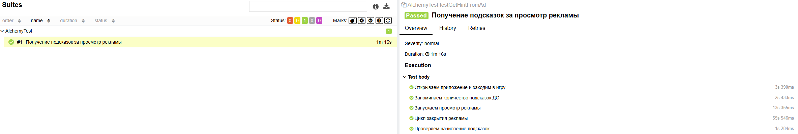

# Автоматизация тестирования приложения "Алхимия: Головоломка"

Проект содержит автоматизированный сценарий проверки функционала получения подсказок за просмотр рекламы.

## Стек технологий
* **Язык:** Java 22
* **Фреймворк для тестов:** JUnit 5
* **Инструмент автоматизации:** Appium + Selenide Appium
* **Сборка:** Maven
* **Отчетность:** Allure

## Требования для запуска
1. **Android SDK** (API 30 / Android 11).
2. **Appium Server** версии 2.x.
3. **Драйвер:** `uiautomator2`.
4. **Java JDK 22**.
5. **Эмулятор:** запущенный девайс (Pixel 4) с именем `emulator-5554` (или изменение настроек в методе `setup`).

## Запуск тестов
1. Запуск эмулятора Android через Android Studio.
2. Запуск Appium сервер в терминале:
   `appium`
## Отчет
   `allure serve target/allure-results`

